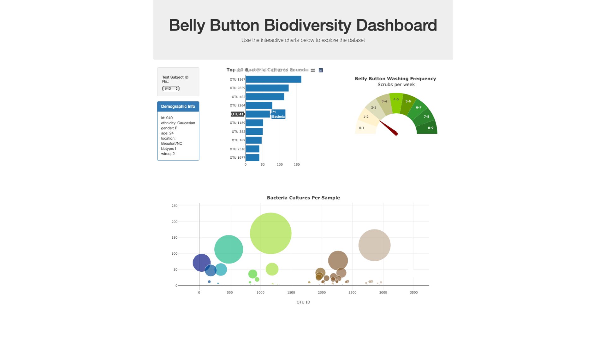

## plotly-challenge  - Belly Button Biodiversity
[Project deployment link](https://changrita1114.github.io/plotly-challenge/)

An interactive dashboard to explore [Belly Button Biodiversity dataset](http://robdunnlab.com/projects/belly-button-biodiversity/) was built in this project, which catalogs the microbes that colonize human navels.

The dataset reveals that a small handful of microbial species (also called operational taxonomic units(OTUs) in the study) were present in more than 70% of people, while the rest were relatively rare.

### Visualization

### Steps: Present the Data Using Plotly and JavaScript
1. The D3.js was used to read in [samples.json](data/samples.json).
2. A horizontal bar chart with a dropdown menu was created to display the top 10 OTUs found in that individual.
3. A bubble chart was created that displays each OTU sample.
4. A gauge chart was created to plot the weekly washing frequency of the individual.
5. An individual's demographic information of the OTU samples metadata was displayed in format of a table.
6. An update function was designed for updating all of the plots any time when a new sample is selected.

### References
Hulcr J., Latimer A.M., Henley J.B., Rountree N.R., Fierer N., et al. (2012) _A Jungle in There: Bacteria in Belly Buttons are Highly Diverse, but Predictable_. PLoS ONE 7(11): e47712. doi:10.1371/journal.pone.0047712

[Dataset link](http://robdunnlab.com/projects/belly-button-biodiversity/results-and-data/)

## Disclaimer
The resources of this master branch are only for educational purposes. All reserved rights belong to UCSD Data Science and Visualization Boot Camp.
